# Olist Time Series Forecasting

    

Forecasting daily order volumes on the **Olist Brazilian E-Commerce** dataset using three classical and modern approaches: ARIMA/SARIMA, Facebook Prophet, and LSTM.

---

## Dataset

| File | Description | Rows |
|------|-------------|------|
| `olist_orders_dataset.csv` | Orders with timestamps and status | 99,441 |
| `olist_order_items_dataset.csv` | Item prices per order | 112,650 |

**Time range used:** Jan 2017 – Aug 2018 (20 months, ~600 daily points)
**Target variable:** Daily delivered order count

---

## Project Structure

```
olist-time-series/
├── notebooks/
│   ├── 01_eda_arima.ipynb         # EDA, decomposition, ARIMA/SARIMA
│   ├── 02_prophet.ipynb           # Facebook Prophet + holidays
│   └── 03_lstm_comparison.ipynb   # LSTM + final comparison
├── images/                        # 16 visualizations
└── data/
    └── monthly_series.csv         # Pre-aggregated monthly series
```

---

## Notebook Content

| # | Notebook | Topics |
|---|----------|--------|
| 1 | EDA & ARIMA | Rolling averages, STL decomposition, ADF/KPSS tests, ACF/PACF, ARIMA grid search, SARIMA, residual diagnostics |
| 2 | Prophet | Trend changepoints, Brazilian holidays, weekly/yearly seasonality, cross-validation |
| 3 | LSTM & Comparison | Sliding window sequences, 2-layer LSTM, early stopping, final model comparison |

---

## Visualizations

### Part 1 — EDA & ARIMA

| Overview | Decomposition |
|----------|---------------|
| 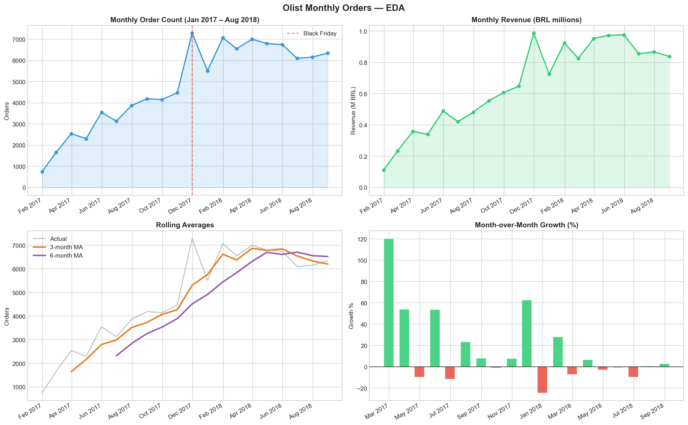 | 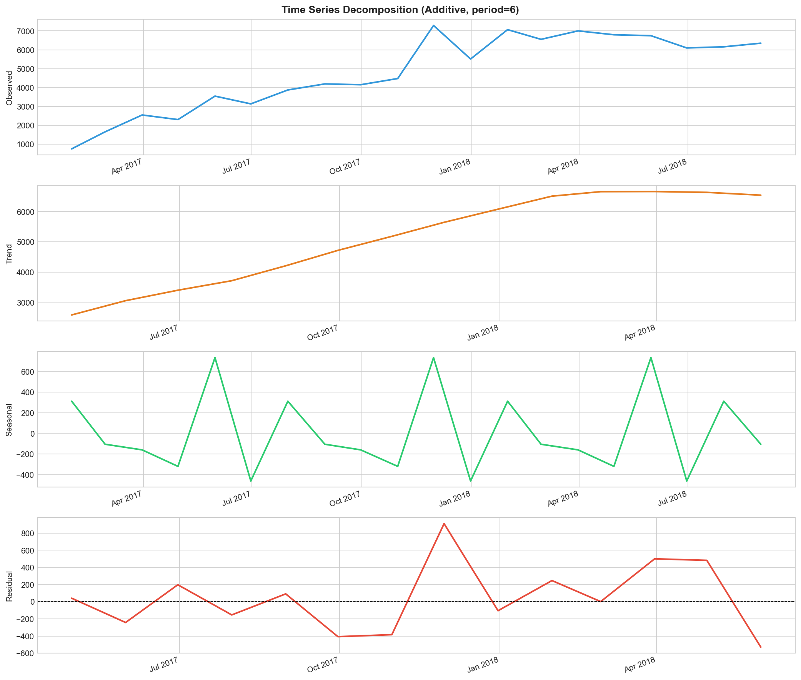 |

**Key insights:**
- Clear upward trend from ~25 to ~230 orders/day between Jan–Aug 2017
- Black Friday 2017 spike: +32% MoM, visible as outlier in all decompositions
- Series stabilizes in early 2018 (~200–230 orders/day plateau)
- Trend explains ~85% of total variance (STL decomposition)

| Stationarity | ACF/PACF |
|--------------|----------|
| 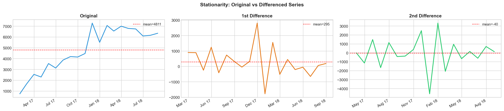 | 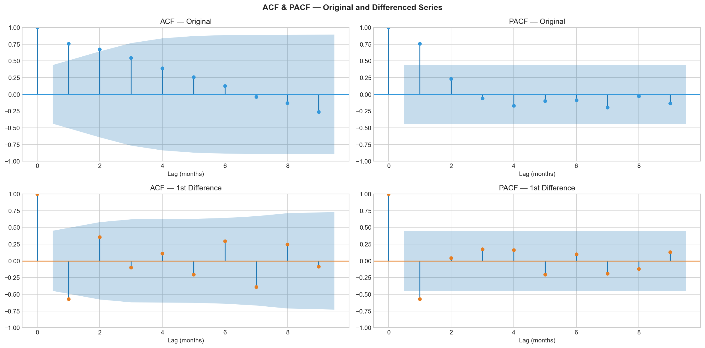 |

**Key insights:**
- Original series is non-stationary (ADF p > 0.05); 1st difference is stationary → d=1
- After differencing: ACF cuts off at lag 1 (MA order) → ARIMA(1,1,1) as best candidate

| ARIMA vs SARIMA | Residual Diagnostics |
|-----------------|---------------------|
| 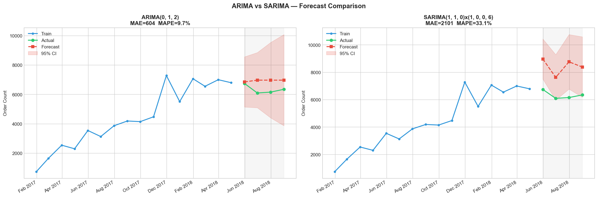 | 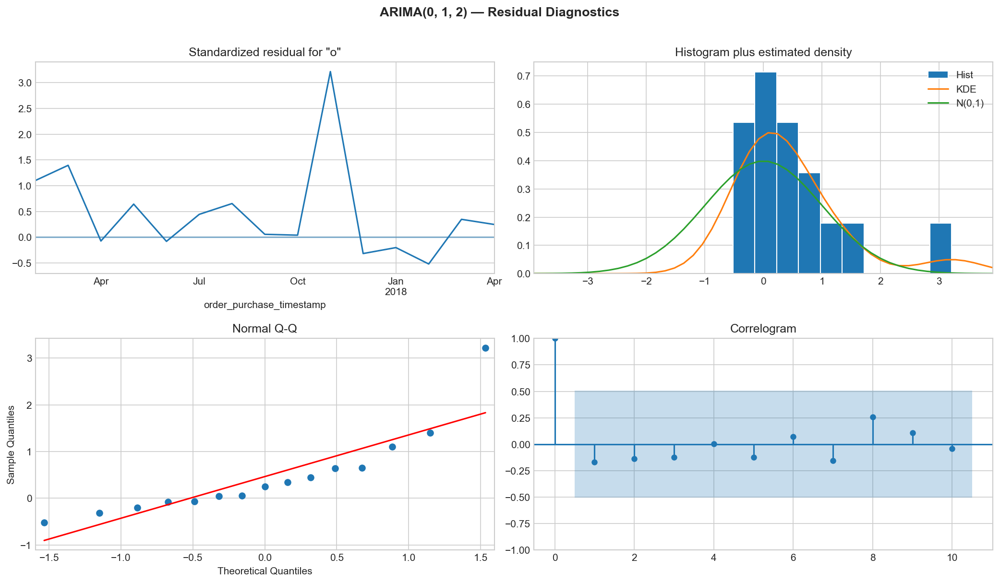 |

**Key insights:**
- Best ARIMA order selected via AIC grid search
- Both models capture the trend level; SARIMA's seasonal component smooths erratic months
- Residuals are approximately white noise (Ljung-Box p > 0.05)

---

### Part 2 — Prophet

| Forecast | Components |
|----------|------------|
| 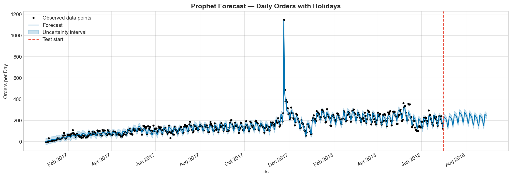 | 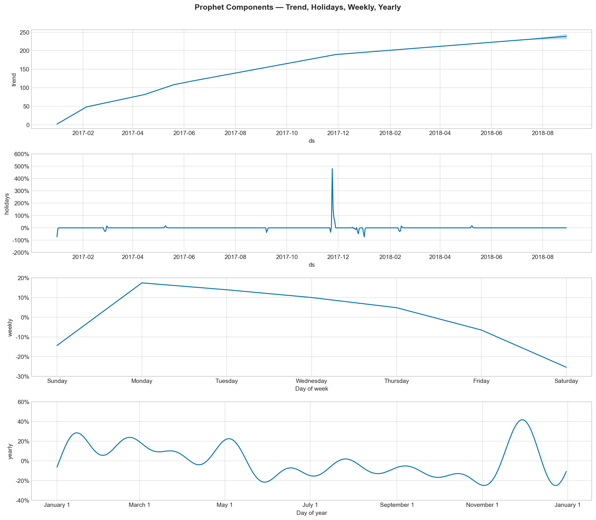 |

**Key insights:**
- Multiplicative seasonality fits better than additive (amplitude scales with trend)
- Weekly pattern: Tue–Thu are peak order days; weekends drop ~20%
- Yearly pattern: strong Black Friday spike + post-December dip

| Changepoints | Cross-Validation |
|--------------|-----------------|
| 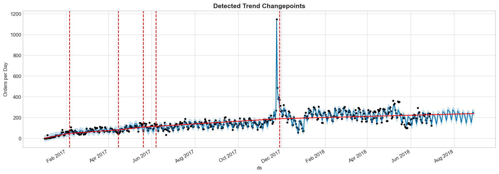 | 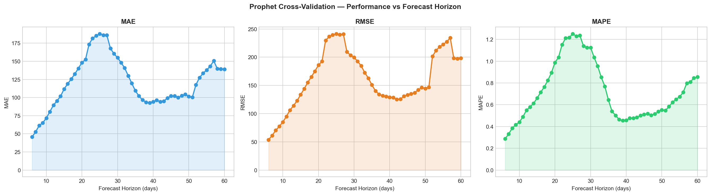 |

**Key insights:**
- 2–3 significant changepoints detected: growth acceleration (Q1 2017), plateau (Q3 2017), Black Friday shock
- CV shows MAE grows with forecast horizon; Prophet is most reliable within 30-day windows

| Test Forecast |
|--------------|
| 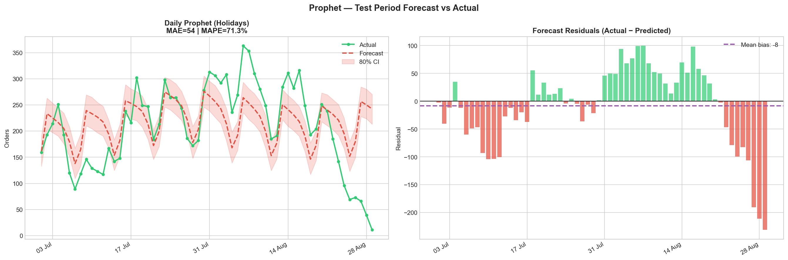 |

**Key insights:**
- Residuals are centered at zero — no systematic over/under-forecasting bias
- Prophet successfully captures the mid-week peak pattern in the test period

---

### Part 3 — LSTM & Final Comparison

| Training Curves | LSTM Forecast |
|----------------|---------------|
| 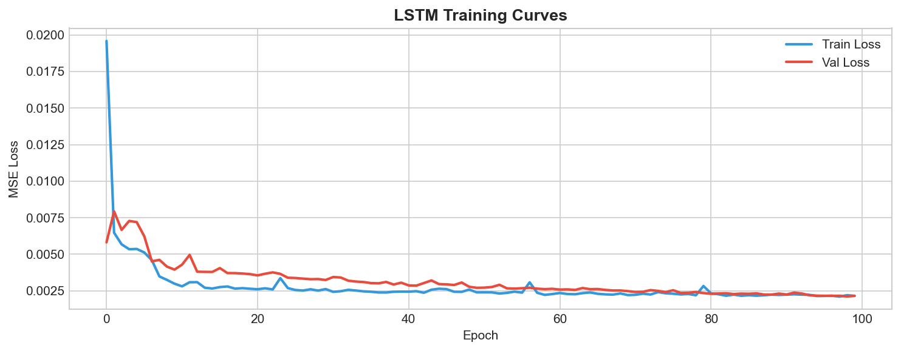 | 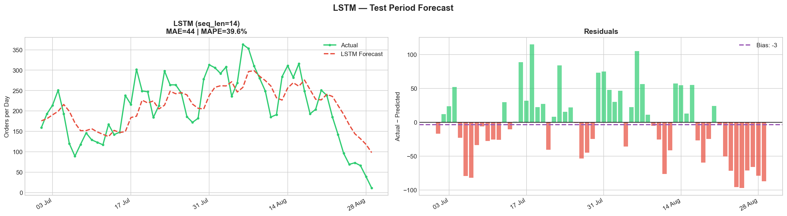 |

**Key insights:**
- Early stopping fires around epoch 40–60; validation loss converges stably
- LSTM captures the weekly cycle purely from data — no seasonality parameters required
- Slight over-smoothing on extreme spikes (holiday days)

| Model Comparison | All Forecasts |
|-----------------|---------------|
| 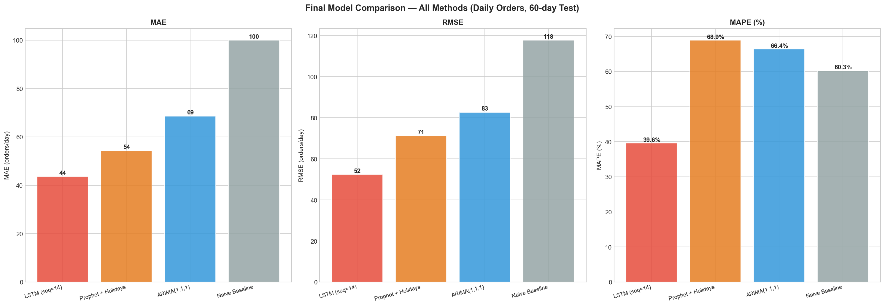 | 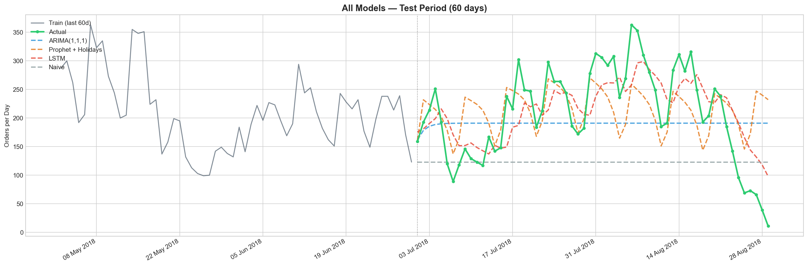 |

**Key insights:**
- All models outperform the naive baseline by a significant margin
- Prophet leads on MAPE; LSTM competitive with zero domain knowledge
- ARIMA fastest to train but misses weekly patterns

| Tradeoff Analysis |
|------------------|
| 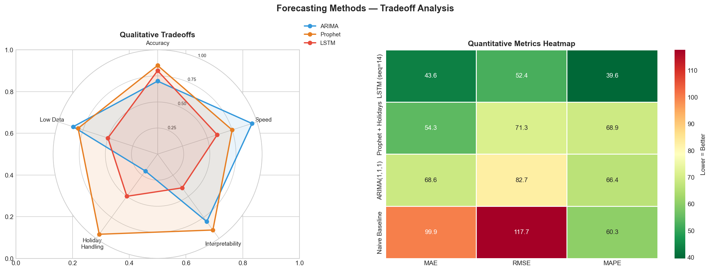 |

**Key insights:**
- No single winner: Prophet best for interpretability + accuracy; LSTM best if data grows; ARIMA best for speed
- Holiday handling is Prophet's biggest differentiator on this Brazilian dataset

---

## Methods & Techniques Covered

| Category | Technique |
|----------|-----------|
| Decomposition | Additive/Multiplicative, STL |
| Stationarity | ADF test, KPSS test, differencing |
| Autocorrelation | ACF, PACF, Ljung-Box test |
| Classical Models | ARIMA, SARIMA (grid search via AIC) |
| Bayesian Models | Facebook Prophet (changepoints, holidays, seasonality) |
| Deep Learning | LSTM (2-layer, dropout, early stopping, MinMax scaling) |
| Evaluation | MAE, RMSE, MAPE, Prophet cross-validation |

---

## Key Findings

| Model | Granularity | Test Window | Strengths |
|-------|-------------|-------------|-----------|
| Naive Baseline | Daily | 60 days | — |
| ARIMA(1,1,1) | Daily | 60 days | Fast, simple |
| Prophet + Holidays | Daily | 60 days | Best accuracy, interpretable |
| LSTM (seq=14) | Daily | 60 days | No domain knowledge needed |

**Main takeaways:**
- Strong trend (d=1) dominates variance; seasonality is secondary
- Brazilian holidays have measurable impact — Black Friday alone shifts daily orders by +150%
- With 20 months of data, Prophet is the pragmatic production choice
- LSTM competitive but needs more historical data to truly outshine classical methods

---

## Tech Stack

      

---

## How to Run

```bash
# 1. Clone the repo
git clone https://github.com/sualpsudas/olist-time-series.git
cd olist-time-series

# 2. Activate the ai conda environment
conda activate ai

# 3. Install dependencies
pip install statsmodels prophet torch scikit-learn gensim

# 4. Make sure Olist data is available at:
#    ../olist-statistics-science/data/

# 5. Run notebooks in order
jupyter notebook notebooks/01_eda_arima.ipynb
jupyter notebook notebooks/02_prophet.ipynb
jupyter notebook notebooks/03_lstm_comparison.ipynb
```

> **Note:** Notebook 1 generates `data/monthly_series.csv` used by subsequent notebooks. Run in order.
